---
## 💻 Preparar entorno para el correcto funcionamiento del sistema
#### ⚙️ Instalación de Java JDK
- Descargamos el JDK e instalamos desde el siguiente enlace:
- https://www.oracle.com/ae/java/technologies/downloads/
---

#### ⚙️ Instalación de Maven
- Descargamos Maven desde:
- https://maven.apache.org/download.cgi
- Luego descomprimimos el .zip en la ruta C:\.
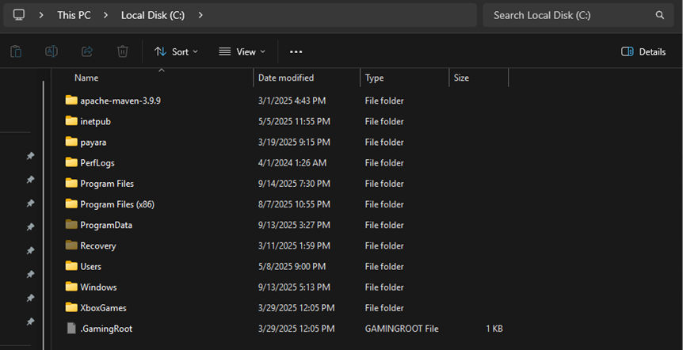
---

#### ⚙️ Instalación de Node.js
- Descargamos e instalamos Node.js desde su sitio oficial:
- https://nodejs.org/en/download
---

#### ⚙️ Instalación de Angular
- Luego de instalar Node.js, abrimos PowerShell y ejecutamos:
- npm install @angular/cli
---

## 💻 Preparamos PATH con las direcciones de Java, Maven y Node.js
#### ⚙️ Para que el sistema reconozca Java, Maven y Node.js, debemos agregar sus rutas a las variables de entorno:
- En Variables del sistema, damos clic en **New**.
- En **Variable name**, colocamos un nombre identificativo (por ejemplo, JAVA_HOME, MAVEN_HOME, NODEJS_HOME).
- En **Variable value**, colocamos la ruta donde está instalado cada programa.
- Repetimos el proceso para los tres programas.
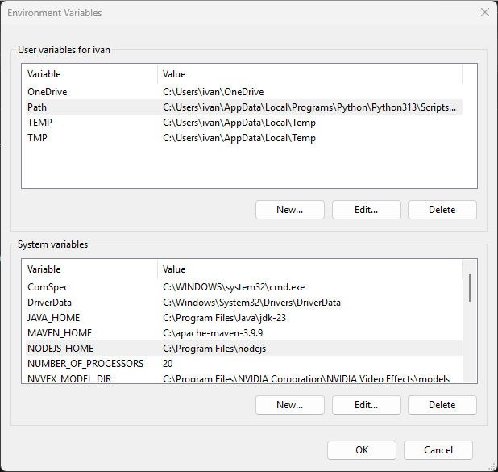
---

## 💻 Pasos para levantar el proyecto
#### ⚙️ Esto se debe realizar en consola o terminal de nuestro editor de código
**Descripción:** En la carpeta principal:
```bash
# Dockerizar el proyecto local (Esto levanta los contenedores del backend, frontend y Postgres):
docker compose -f docker-compose_local.yml up --build

# Dockerizar el proyecto produccion (Esto levanta los contenedores del backend y frontend):
docker compose -f docker-compose_production.yml up --build

# En caso de requerir eliminar el contenedor local:
docker compose -f docker-compose_local.yml down -v

# En caso de requerir eliminar el contenedor local:
docker-compose -f docker-compose_production.yml down -v
```
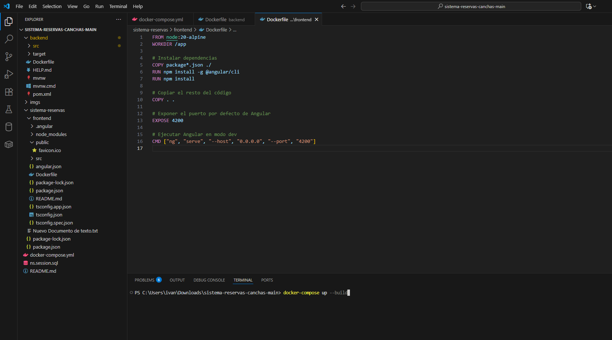
---

## 📁 Capturas del proyecto funcionando
#### ⚙️ Captura del inicio de sesión
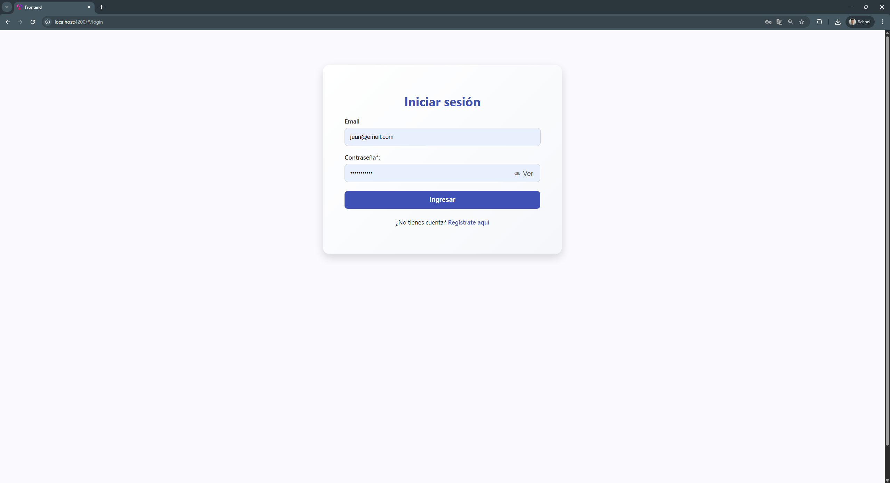
---

#### ⚙️ Captura del registro de usuario
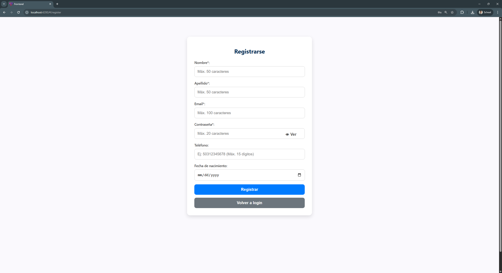
---

#### ⚙️ Captura de la pantalla principal
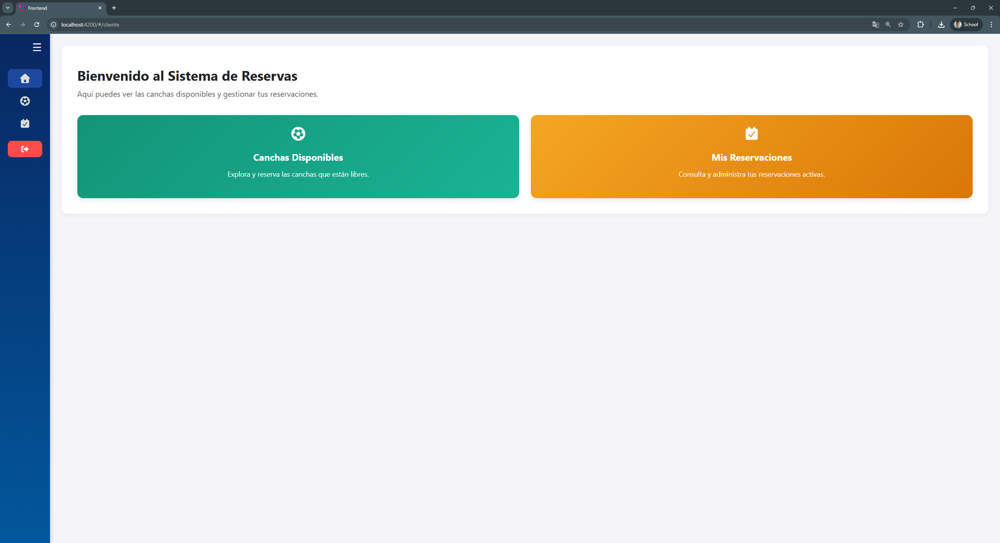
---

#### ⚙️ Captura de las canchas disponibles
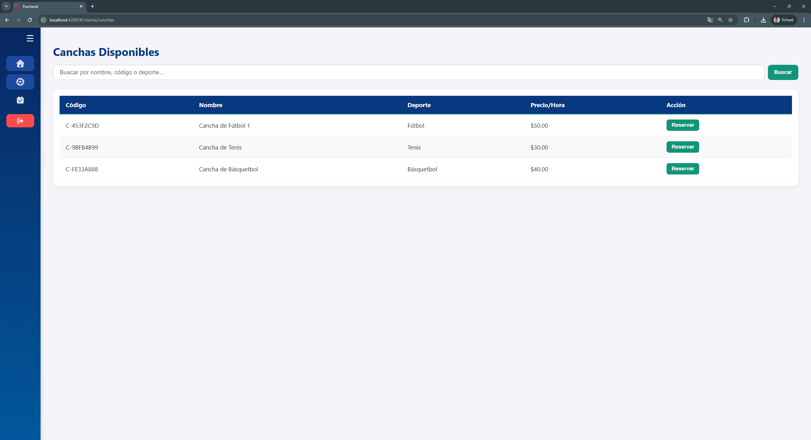
---

#### ⚙️ Captura del formulario para realizar una reserva de una cancha
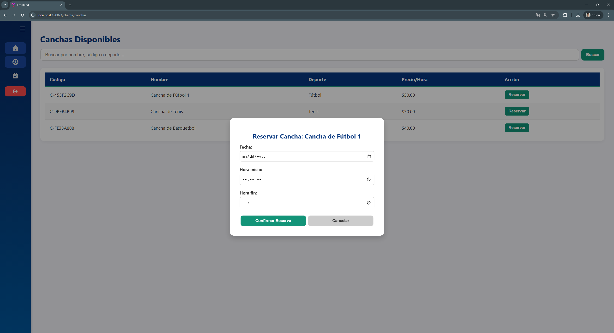
---

#### ⚙️ Captura que muestra el historial de las reservas
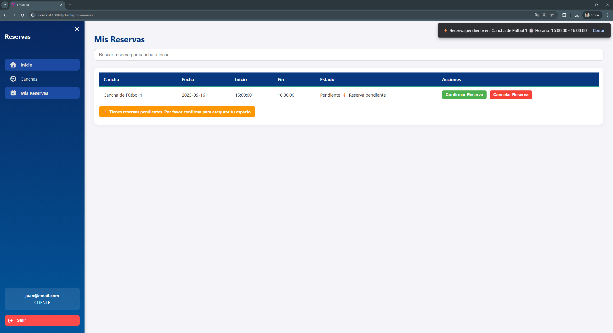
---

#### ⚙️ Captura de los metodos de pago disponibles
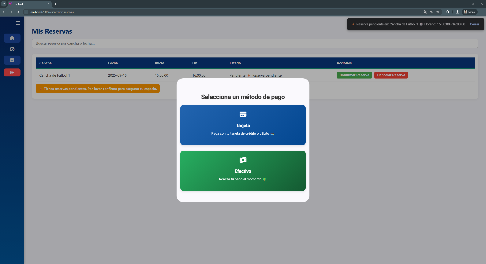
---

#### ⚙️ Captura del formulario de pago con tarjeta
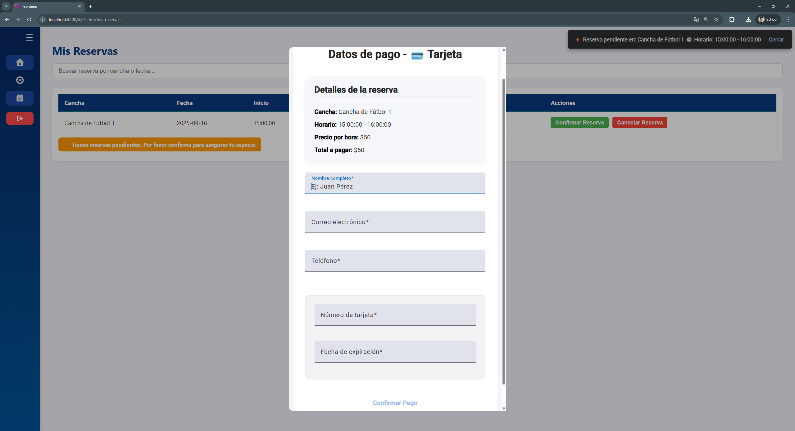
---

#### ⚙️ Captura del formulario del pago en efectivo
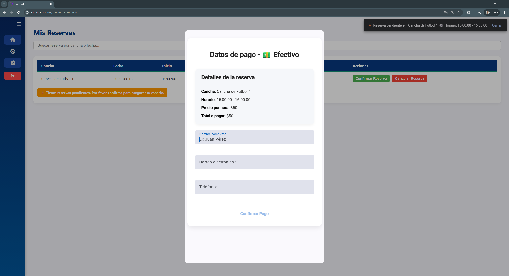
---

#### ⚙️ Captura de los detalles en una factura
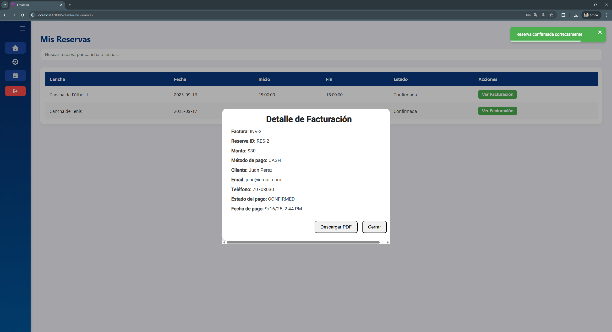
---

#### ⚙️ Captura del pdf generado por detalles de la factura
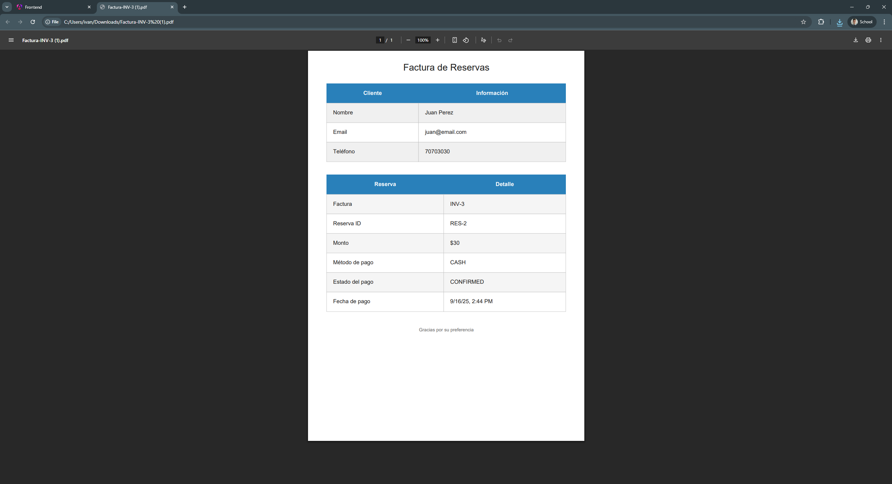
---
